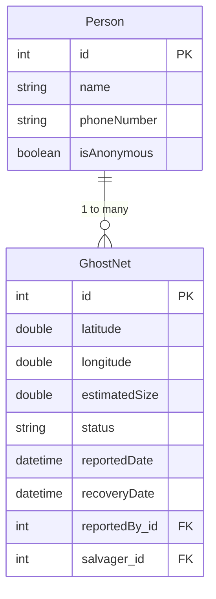
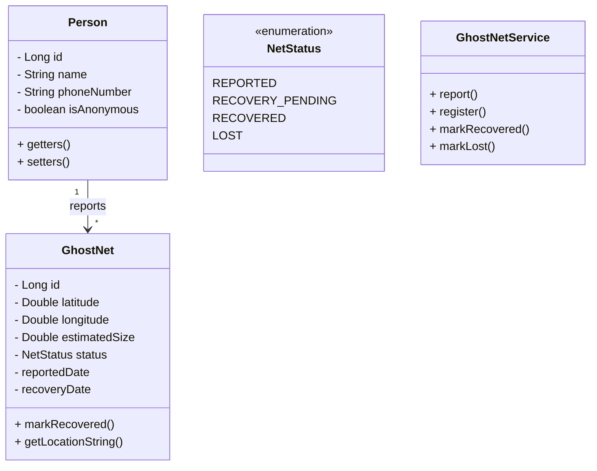
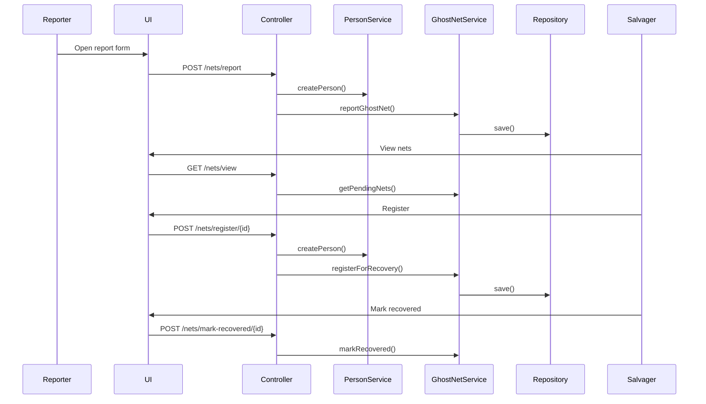

# 🌊 Ghost Net Fishing – Web Application

A Java Spring Boot application for reporting, tracking, and recovering abandoned fishing nets ("ghost nets") in the ocean.


## 📖 Project Overview

Ghost nets are abandoned fishing nets that drift in the ocean and harm marine ecosystems.
This application allows:

* People to **report ghost nets** (anonymously or with contact details)
* Salvaging personnel to **view**, **register**, and **recover** nets
* Coordinated tracking of recovery progress
* Viewing all nets and their statuses

This project was developed as part of the *Software Engineering / Web Engineering* module using **Spring Boot**, **JPA**, **MySQL**, and **Thymeleaf**.

---

## 🚀 Features

### ✅ MUST Requirements

* Report a ghost net (optionally anonymous)
* View all nets awaiting recovery
* Salvager can register for recovering a net
* Salvager can mark a net as recovered

### 🎯 COULD Requirements

* View active recovery assignments
* Mark nets as lost (non-anonymous reporting only)

---

## 🛠 Tech Stack

### **Backend**

* Java 17
* Spring Boot 3
* Spring MVC
* Spring Data JPA (Hibernate)
* MySQL 8

### **Frontend**

* Thymeleaf templating engine
* HTML, CSS

### **Build Tools**

* Maven
* Lombok (optional)

---


### Layers:

* **Controller Layer**: Handles HTTP requests
* **Service Layer**: Business logic
* **Repository Layer**: Data persistence with JPA
* **Entity Layer**: Domain model objects

---

## 🗄 Database Schema (ER Diagram)



---

## 📘 UML Class Diagram



---

## 📈 Sequence Diagram



---

## 🧩 Project Structure

```
ghost-net-fishing/
│
├── src/main/java/com/ghostnet/
│   ├── controller/
│   ├── entity/
│   ├── repository/
│   ├── service/
│   └── GhostNetApplication.java
│
├── src/main/resources/
│   ├── templates/ (Thymeleaf HTML)
│   └── application.properties
│
├── pom.xml
└── README.md
```

---

## 🔧 Installation & Setup

### 1️⃣ Install Requirements

* Java 17
* Maven
* MySQL

### 2️⃣ Create MySQL Database

```sql
CREATE DATABASE ghostnet_db;
CREATE USER 'ghostnet_user'@'localhost' IDENTIFIED BY 'ghostnet_pass';
GRANT ALL PRIVILEGES ON ghostnet_db.* TO 'ghostnet_user'@'localhost';
FLUSH PRIVILEGES;
```

---

## ▶️ How to Run the Project

### **Step 1: Build**

```
mvn clean install
```

### **Step 2: Run**

```
mvn spring-boot:run
```

### **Step 3: Open Browser**

```
http://localhost:8080
```

---

## 🖼 Screenshots

### Screen 1

### Screen 2

### Screen 3

### Screen 4

### Screen 5


---

## 🚀 Future Improvements

* Interactive world map (Leaflet / OpenLayers)
* User authentication system
* Email/SMS notifications
* REST API version
* Admin dashboard for analytics

---

## 📄 License

MIT License — free to use and modify.


