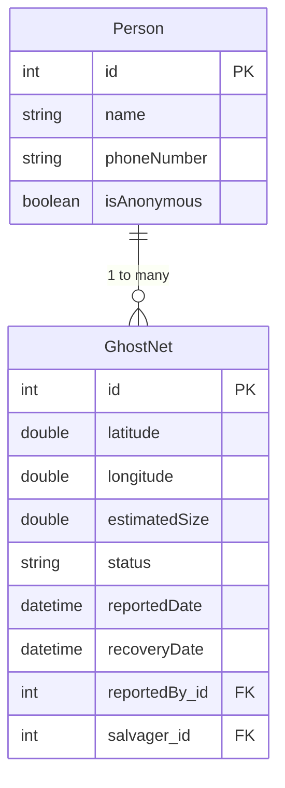
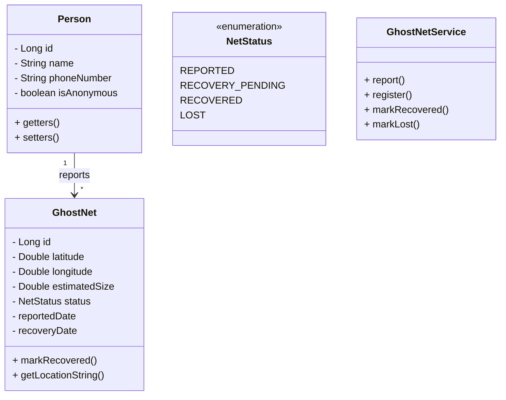
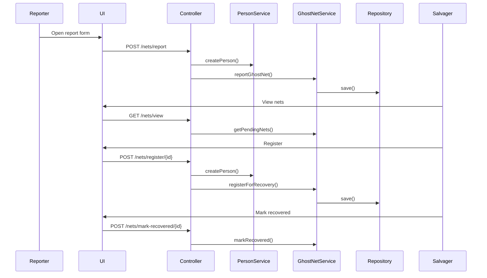
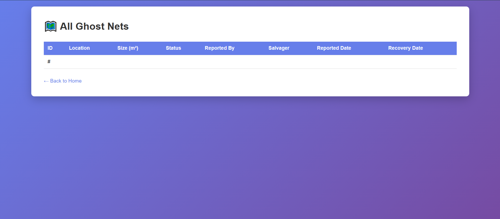
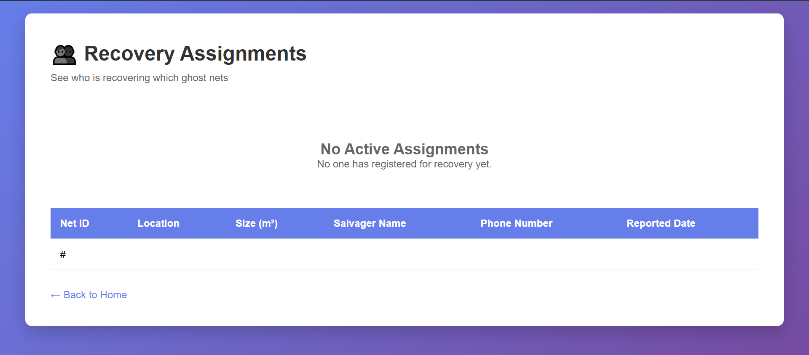
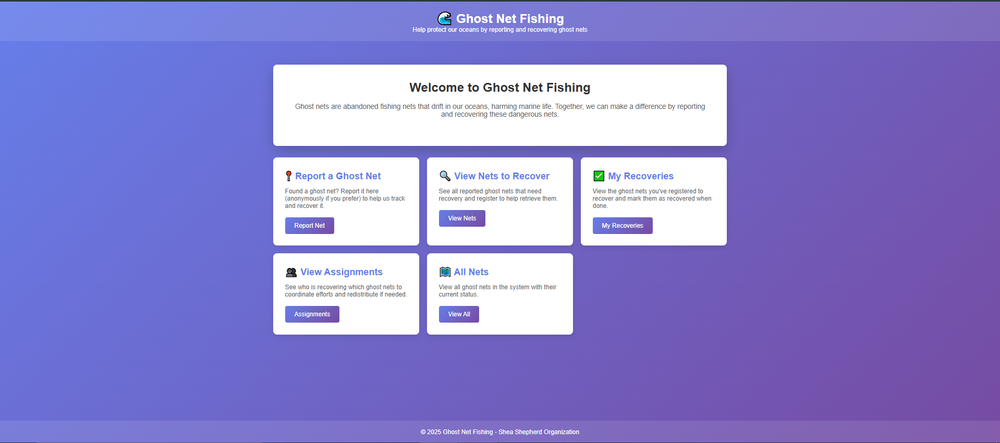
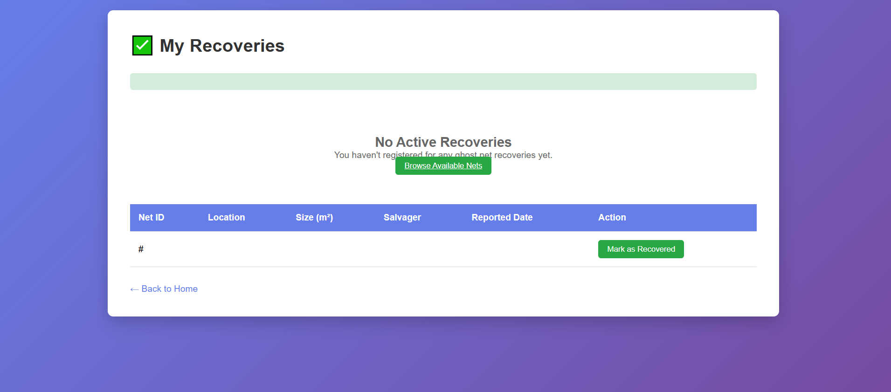
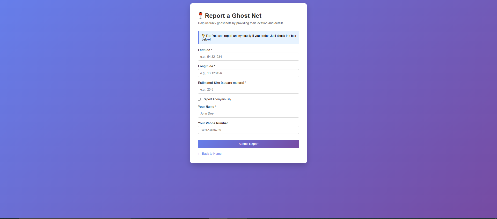

# 🌊 Ghost Net Fishing – Web Anwendung

Eine Java Spring Boot-Anwendung zum Melden, Verfolgen und Bergen von ausgesetzten Fischernetzen („Geisternetzen“) im Meer.

## 📖 Projektübersicht

Geisternetze sind ausgesetzte Fischernetze, die im Meer treiben und die marinen Ökosysteme schädigen. Diese Anwendung ermöglicht:

• Personen, Geisternetze anonym oder mit Kontaktdaten zu melden
  
• Bergungspersonal, Netze anzuzeigen, zu registrieren und zu bergen

• Die koordinierte Verfolgung des Bergungsfortschritts

• Das Anzeigen aller Netze und ihrer Status


Dieses Projekt wurde im Rahmen des Moduls Software Engineering / Web Engineering unter Verwendung von Spring Boot, JPA, MySQL und Thymeleaf entwickelt.

---

## 🚀 Features

### ✅ MUSS-Anforderungen (MUST Requirements)

• Ein Geisternetz melden (optional anonym)
• Alle Netze anzeigen, die auf die Bergung warten
• Bergungspersonal kann sich für die Bergung eines Netzes registrieren
• Bergungspersonal kann ein Netz als geborgen markieren


### 🎯 SOLLTE-Anforderungen (COULD Requirements)

Aktive Bergungszuweisungen anzeigen
• Netze als verloren markieren (nur bei nicht-anonymer Meldung)


---

## 🛠 Tech Stack

### **Backend**

* Java 17
* Spring Boot 3
* Spring MVC
* Spring Data JPA (Hibernate)
* MySQL 8

### **Frontend**

* Thymeleaf templating engine
* HTML, CSS

### **Software-Werkzeuge**

* Maven
* Lombok (optional)

---


### Layers/Schichten:

* **Controller Layer/Controller-Schicht**: Verarbeitet eingehende HTTP Anfragen
* **Service Layer/Service-Schicht**: Beinhaltet die Geschäftslogik der Anwendung (z.B. Überprüfung der Bergungsregeln)
* **Repository Layer/Repository-Schicht**: Verantwortlich für die Datenpersistenz mit JPA
* **Entity Layer/Entitäts-Schicht**: Definiert die Domänenmodell-Objekte (z.B. Person und GhostNet)

---

## 🗄 Datenbankschema (ER Diagram)



---

## 📘 UML Klassendiagramm



---

## 📈 Sequenzdiagramm



---

## 🧩 Projektstruktur

```
ghost-net-fishing/
│
├── src/main/java/com/ghostnet/
│   ├── controller/
│   ├── entity/
│   ├── repository/
│   ├── service/
│   └── GhostNetApplication.java
│
├── src/main/resources/
│   ├── templates/ (Thymeleaf HTML)
│   └── application.properties
│
├── pom.xml
└── README.md
```

---

## 🔧 Installation & Einstellungen

### 1️⃣ Install Requirements

* Java 17
* Maven
* MySQL

### 2️⃣ Create MySQL Database

```sql
CREATE DATABASE ghostnet_db;
CREATE USER 'ghostnet_user'@'localhost' IDENTIFIED BY 'ghostnet_pass';
GRANT ALL PRIVILEGES ON ghostnet_db.* TO 'ghostnet_user'@'localhost';
FLUSH PRIVILEGES;
```

---

## ▶️ How to Run the Project/Wie man das Projekt ausführt 

### **Step 1: Build**

```
mvn clean install
```

### **Step 2: Run/Ausführen**

```
mvn spring-boot:run
```

### **Step 3: Open Browser**

```
http://localhost:8080
```

---

## 🖼 Screenshots

### Screen 1

### Screen 2

### Screen 3

### Screen 4

### Screen 5


---

## 🚀 Zukünftige Verbesserungen

* Interaktive Weltkarte (mit Leaflet/OpenLayers)
* Benutzerauthentifizierungssystem
* Email-/SMS- Benachrichtigungen
* REST-API-Version
* Admin dashboard für Analysen

---

## 📄 Lizenz

MIT Lizenz — zur freien Nutzung und Modifizierung.


